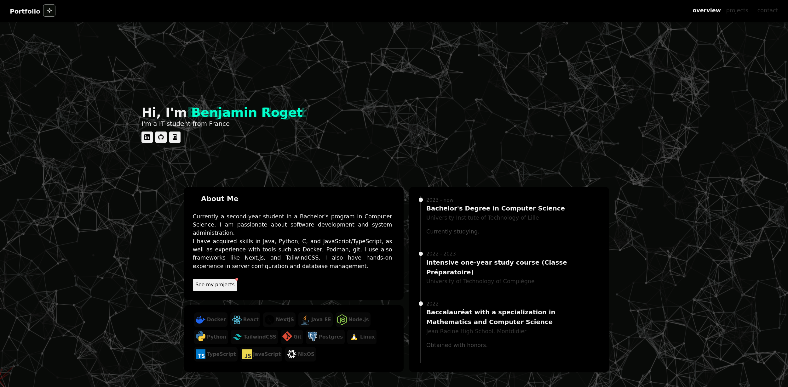

# My Portfolio

Welcome to my portfolio! This project is built with React and Next.js, showcasing my skills and projects.

## Table of Contents

- [About](#about)
- [Features](#features)
- [Technologies Used](#technologies-used)
- [Getting Started](#getting-started)
- [Deployment](#deployment)
- [Contributing](#contributing)
- [License](#license)
- [Contact](#contact)

## About



This portfolio is a representation of my work and abilities as a developer. It includes a collection of projects that highlight my skills and experiences. You can find information about my experiences, a list of the technologies I work with, and links to my projects.

## Features

- Responsive design that works on mobile and desktop
- Smooth navigation between sections
- Interactive project showcase with detailed descriptions

## Technologies Used

- [Next.js](https://nextjs.org/) - A React framework for building server-side rendered applications
- [React](https://reactjs.org/) - A JavaScript library for building user interfaces
- CSS Modules - For styling components
- Node.js - For the server-side
- My home server - For hosting the portfolio

## Getting Started

To get a local copy of this portfolio up and running, follow these steps:

1. Clone the repository:
   ```bash
   git clone https://github.com/Strange500/nextPortfolio.git
   cd nextPortfolio
   ```
2. Install the dependencies:
   ```bash
    npm install
    ```
3. Run the development server:
   ```bash
    npm run dev
    ```
4. Open [http://localhost:3000](http://localhost:3000) in your browser

## Configuration

### Custom Projects Data File

By default, project information is loaded from `data/projects.json`. You can specify a custom projects file using the `PROJECTS_FILE_PATH` environment variable:

```bash
# Use a custom projects file
PROJECTS_FILE_PATH=path/to/your/projects.json npm run build

# Or in development
PROJECTS_FILE_PATH=path/to/your/projects.json npm run dev
```

The projects JSON file should follow this structure:
```json
[
  {
    "order": 1,
    "title": "Project Name",
    "description": "Project description",
    "tags": ["Tag1", "Tag2"],
    "links": ["https://github.com/user/repo"],
    "readme": "https://raw.githubusercontent.com/user/repo/main/README.md"
  }
]
```

If the specified file doesn't exist or contains invalid JSON, the application will gracefully fall back to an empty projects array and log appropriate error messages.

## Deployment with Docker

To deploy this portfolio with Docker, follow these steps:

1. Build the Docker image:
   ```bash
   docker build -t next-portfolio .
   ```
2. Run the Docker container:
   ```bash
    docker run -d -p 3000:3000 next-portfolio
    ```
3. Open [http://localhost:3000](http://localhost:3000) in your browser
