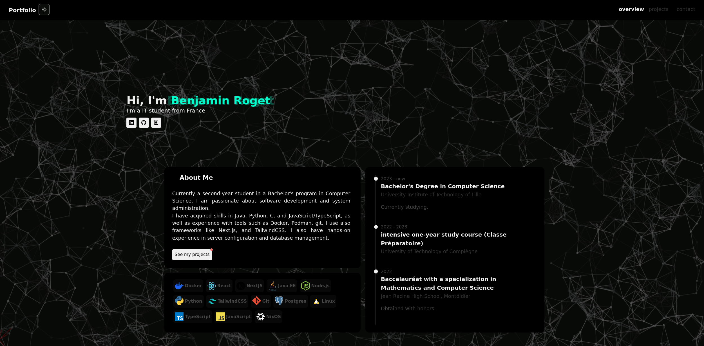

# My Portfolio

Welcome to my portfolio! This project is built with React and Next.js, showcasing my skills and projects.

## Table of Contents

- [About](#about)
- [Features](#features)
- [Technologies Used](#technologies-used)
- [Getting Started](#getting-started)
- [Deployment](#deployment)
- [Contributing](#contributing)
- [License](#license)
- [Contact](#contact)

## About



This portfolio is a representation of my work and abilities as a developer. It includes a collection of projects that highlight my skills and experiences. You can find information about my experiences, a list of the technologies I work with, and links to my projects.

## Features

- Responsive design that works on mobile and desktop
- Smooth navigation between sections
- Interactive project showcase with detailed descriptions

## Technologies Used

- [Next.js](https://nextjs.org/) - A React framework for building server-side rendered applications
- [React](https://reactjs.org/) - A JavaScript library for building user interfaces
- CSS Modules - For styling components
- Node.js - For the server-side
- My home server - For hosting the portfolio

## Getting Started

To get a local copy of this portfolio up and running, follow these steps:

1. Clone the repository:
   ```bash
   git clone https://github.com/Strange500/nextPortfolio.git
   cd nextPortfolio
   ```
2. Install the dependencies:
   ```bash
    npm install
    ```
3. Run the development server:
   ```bash
    npm run dev
    ```
4. Open [http://localhost:3000](http://localhost:3000) in your browser

## Configuration

### Custom Projects Data File

By default, project information is loaded from `data/projects.json`. You can specify a custom projects file using the `PROJECTS_FILE_PATH` environment variable:

```bash
# Use a custom projects file
PROJECTS_FILE_PATH=path/to/your/projects.json npm run build

# Or in development
PROJECTS_FILE_PATH=path/to/your/projects.json npm run dev
```

The projects JSON file should follow this structure:
```json
[
  {
    "order": 1,
    "title": "Project Name",
    "description": "Project description",
    "tags": ["Tag1", "Tag2"],
    "links": ["https://github.com/user/repo"],
    "readme": "https://raw.githubusercontent.com/user/repo/main/README.md"
  }
]
```

**Path Support**: The `PROJECTS_FILE_PATH` environment variable supports both relative and absolute paths:
- Relative paths (e.g., `custom/projects.json`) are resolved from the project root
- Absolute paths (e.g., `/opt/data/projects.json`) allow loading files from anywhere on the system

**Error Handling**: If the specified file doesn't exist, contains invalid JSON, or is empty, the application will gracefully fall back to the default projects (same as `data/projects.json`) and log appropriate error messages. This ensures the portfolio always displays content even when custom project files have issues.

## Resume Generation & Theming

This portfolio acts as a single source of truth to automatically generate PDF resumes in both English and French. The resume pipeline supports a robust theme system capable of rendering standard ATS layouts as well as any community `jsonresume-theme-*` from npm.

### Quick Commands

```bash
# Generate both EN and FR JSON Resumes and PDFs using default themes
npm run resume

# List all configured and available themes
npm run resume:themes

# Generate only the English resume
npm run resume:en

# Generate only the French resume
npm run resume:fr
```

### Changing Themes

By default, the English version uses an ATS-friendly single-column layout, and the French version can be customized independently. 

To permanently change the default themes, edit `scripts/themes.config.json`:
```json
{
  "en": "even",
  "fr": "weasyprint"
}
```

You can also test themes on the fly without changing defaults:
```bash
# Render EN resume with the 'even' theme and FR with 'flat'
./scripts/generate-resume.sh --theme-en even --theme-fr flat

# Use a new jsonresume theme from npm and auto-install it
./scripts/generate-resume.sh --theme-en stackoverflow --install
```

For full details on how the universal rendering pipeline works (Puppeteer + Chromium + WeasyPrint), see [scripts/README.md](scripts/README.md).

## Deployment with Docker

To deploy this portfolio with Docker, follow these steps:

1. Build the Docker image:
   ```bash
   docker build -t next-portfolio .
   ```
2. Run the Docker container:
   ```bash
    docker run -d -p 3000:3000 next-portfolio
    ```
3. Open [http://localhost:3000](http://localhost:3000) in your browser
