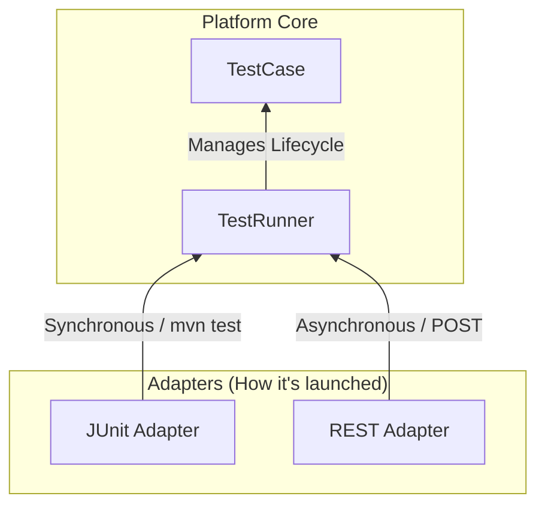

# One E2E Test, Multiple Execution Paths: Building a Test Platform with Spring Boot

<Tldr>
**Result:** Rebuilt the E2E test platform so a single test definition runs through both synchronous CI (JUnit / Maven) and an asynchronous interactive dashboard — without duplicating any test logic.

**Measured impact:**
- **~70% fewer false-positive** pipeline failures.
- Invalid runs fail in **~50 ms** instead of spinning up a **20 s** browser session.
- A run that isn't ready to proceed never touches shared state, so testers **working concurrently on the same environment don't interfere** with each other.
</Tldr>

Our end-to-end (E2E) test suite originally had a single execution model: tests were JUnit classes executed via Maven inside Jenkins pipelines.

That worked well for automated nightly builds, but it became limiting as the platform grew:
- Developers wanted to run specific scenarios locally or on demand without triggering a full CI/CD build.
- QA and Product teams needed an interactive web dashboard to launch tests with custom parameter datasets.
- Expensive browser sessions were constantly being spun up only to fail 5 seconds later due to unmet technical or business prerequisites.

The initial idea was to add a REST controller on top of the test code. However, doing that directly creates two divergent execution paths:


```text

Jenkins ──> JUnit ──> Test Logic

Web UI  ──> REST  ──> Test Logic

```

Without a shared core, these two paths quickly drift apart in how they handle parameters, browser lifecycles, logging context, and result formats.

The architectural thesis of the refactoring was simple:

> **A test should be entirely ignorant of how it is launched.**

This principle led to a strict separation between *what* is tested and *how* it is executed:



This article details the implementation of this execution-agnostic test platform using Spring Boot and JUnit 5.

---

## 1. Decoupling Definition from Execution

A clean separation of concerns requires two distinct layers:

1. **`TestCase<P>`**: Defines the test configuration (metadata, required conditions, and business steps).
2. **`TestRunner`**: Handles the execution lifecycle (precondition evaluation, Selenium driver management, structured result generation).

### The Test Definition (`TestCase<P>`)

Every test class is a Spring component extending `TestCase<P>`, parameterized by a DTO `P`. It contains zero execution logic.

```java
package com.example.framework.testcase;

import com.example.framework.condition.ExecutionCondition;
import java.util.List;

public abstract class TestCase<P extends BaseTestParams> {

    public abstract String id();
    public abstract String name();
    
    // Type definition for REST payload parsing
    public abstract Class<P> parameterType();
    
    // Default datasets for automated CI pipelines
    public abstract List<P> defaultParameters();
    
    // Core scenario logic implemented by the test developer
    public abstract boolean execute(P params) throws Exception;

    // Declarative prerequisites (Evaluated BEFORE opening a browser)
    public List<ExecutionCondition> conditions() {
        return List.of();
    }
}

```

### The Orchestrator (`TestRunner`)

The `TestRunner` service encapsulates the lifecycle. It is the only component allowed to touch the underlying test execution logic, ensuring that regardless of who triggered the test, the environment is set up and torn down identically. The entire process, including preconditions, is wrapped in a `try-catch` to guarantee structured logging.

```java
package com.example.framework.engine;

import com.example.framework.testcase.TestCase;
import com.example.framework.result.TestResult;
import org.springframework.stereotype.Service;

@Service
public class TestRunner {

    private final WebDriverManager driverManager;

    public TestRunner(WebDriverManager driverManager) {
        this.driverManager = driverManager;
    }

    public <P extends BaseTestParams> TestResult run(TestCase<P> testCase, P params) {
        long startTime = System.currentTimeMillis();

        try {
            // 1. Evaluate Cold Preconditions
            for (ExecutionCondition condition : testCase.conditions()) {
                var result = condition.evaluate();
                if (!result.success()) {
                    return TestResult.skipped(result.reason(), startTime);
                }
            }

            // 2. Execute Lifecycle
            driverManager.initDriver(params.getBrowser());
            boolean success = testCase.execute(params);
            
            return success ? 
                TestResult.success(startTime) : 
                TestResult.failed("Scenario assertions failed.", startTime);
                
        } catch (Exception e) {
            // Capture structured failure information
            return TestResult.crashed("Unhandled execution exception", e, startTime);
        } finally {
            driverManager.quitDriverSafely();
        }
    }
}

```

---

## 2. Test Discovery and Strongly-Typed Parameters

If a test is agnostic to its trigger, the framework needs a mechanism to inject the correct parameters from external REST calls. This is handled by the `TestRegistry`.

Because every `TestCase` is a Spring `@Component`, they are injected into a central registry at startup. This enables a dual-purpose routing model:

* **For REST APIs:** `parameterType()` allows the `ObjectMapper` to parse raw JSON into the strongly-typed Java record `P`.
* **For CI/CD:** `defaultParameters()` provides the baseline datasets so the JUnit engine knows what to run automatically during a pipeline build.

```java
package com.example.framework.registry;

import com.fasterxml.jackson.databind.JsonNode;
import com.fasterxml.jackson.databind.ObjectMapper;
import org.springframework.stereotype.Component;
import java.util.Map;
import java.util.stream.Collectors;

@Component
public class TestRegistry {

    private final Map<String, TestCase<?>> tests;
    private final ObjectMapper objectMapper;

    public TestRegistry(List<TestCase<?>> testCases, ObjectMapper objectMapper) {
        this.objectMapper = objectMapper;
        this.tests = testCases.stream()
            .collect(Collectors.toMap(TestCase::id, t -> t));
    }

    public TestCase<?> get(String id) {
        if (!tests.containsKey(id)) {
            throw new IllegalArgumentException("Test not found: " + id);
        }
        return tests.get(id);
    }

    public <P extends BaseTestParams> P parseParams(TestCase<P> testCase, JsonNode payload) {
        return objectMapper.convertValue(payload, testCase.parameterType());
    }
}

```

---

## 3. Asynchronous Execution Model for REST Clients

E2E tests in enterprise platforms often take between 30 seconds and 15 minutes to execute. Holding an HTTP connection open for this duration causes gateway timeouts and thread starvation.

To handle this, the REST API uses an asynchronous polling pattern:

1. The client submits a `POST` request.
2. The server immediately returns `202 Accepted` with a `QUEUED` status.
3. A background thread pool evaluates preconditions and runs the test.
4. The client polls a `GET` endpoint to observe state transitions (`QUEUED` → `RUNNING` → `SUCCESS` | `FAILED` | `SKIPPED`).

```java
package com.example.framework.api;

import org.springframework.http.ResponseEntity;
import org.springframework.scheduling.concurrent.ThreadPoolTaskExecutor;
import org.springframework.web.bind.annotation.*;

@RestController
@RequestMapping("/api/v1/executions")
public class ExecutionController {

    private final TestRegistry testRegistry;
    private final TestRunner testRunner;
    private final ExecutionTaskStore taskStore;
    private final ThreadPoolTaskExecutor testExecutor;

    @PostMapping
    public ResponseEntity<ExecutionTask> startExecution(@RequestBody ExecutionRequest request) {
        var testCase = testRegistry.get(request.testId());
        var params = testRegistry.parseParams(testCase, request.payload());
        
        String executionId = UUID.randomUUID().toString();
        ExecutionTask task = taskStore.create(executionId, testCase.name()); // Status: QUEUED

        testExecutor.submit(() -> {
            taskStore.markRunning(executionId);
            
            var result = testRunner.run(testCase, params); 
            
            taskStore.markCompleted(executionId, result);
        });

        return ResponseEntity.accepted().body(task);
    }
}

```

---

## 4. Adapting to CI/CD with Dynamic JUnit 5 Tests

While the REST API runs tests asynchronously for the web UI, Jenkins and Maven require synchronous JUnit 5 executions to produce standard XML Surefire reports.

The JUnit adapter utilizes JUnit 5’s `@TestFactory` to hook into the exact same `TestRunner`, automatically expanding the parameterized datasets provided by `defaultParameters()`:

```java
package com.example.framework.adapter.junit;

import org.junit.jupiter.api.Assumptions;
import org.junit.jupiter.api.DynamicTest;
import org.junit.jupiter.api.TestFactory;

@Component
public class TestSuiteFactory {

    @Autowired
    private TestRegistry registry;

    @Autowired
    private TestRunner testRunner;

    @TestFactory
    public Stream<DynamicTest> generateDynamicTests() {
        return registry.getAll().stream().flatMap(testCase -> 
            testCase.defaultParameters().stream().map(params -> 
                DynamicTest.dynamicTest(
                    testCase.name() + " (" + params.getEnvironment() + ")",
                    () -> executeInJUnitContext(testCase, params)
                )
            )
        );
    }

    @SuppressWarnings("unchecked")
    private <P extends BaseTestParams> void executeInJUnitContext(TestCase<P> testCase, Object params) {
        var result = testRunner.run(testCase, (P) params);

        if (result.status() == TestStatus.SKIPPED) {
            Assumptions.assumeTrue(false, result.message()); 
        }

        org.junit.jupiter.api.Assertions.assertEquals(
            TestStatus.SUCCESS, 
            result.status(), 
            "Test failed: " + result.message()
        );
    }
}

```

> **Note on CI Visuals:** By mapping the internal `SKIPPED` status to JUnit's `Assumptions.assumeTrue(false)`, native test runners register the execution as *Aborted*. CI/CD tools like Jenkins consume this report and properly classify the test as unstable or skipped, preventing false-positive pipeline failures. In practice, this mapping cut false-positive pipeline failures by roughly 70%.

---

## 5. Cold Preconditions: Checking Business Reality

Launching a Selenium WebDriver session takes significant time. Running that setup only to discover that a prerequisite business state hasn't been met wastes compute time.

The framework uses lightweight guardrails that check HTTP APIs or database states before the browser is initialized. These checks validate specific business scenarios rather than just infrastructure availability.

### Example: Verifying Payroll Data Prerequisites

Consider a test that simulates a therapeutic part-time absence declaration. Before opening the browser, the framework evaluates the business context:

```java
package com.example.framework.condition;

public class TherapeuticAbsenceDsnCondition implements ExecutionCondition {

    private final HrApiClient apiClient;
    private final String agentId;

    public TherapeuticAbsenceDsnCondition(HrApiClient apiClient, String agentId) {
        this.apiClient = apiClient;
        this.agentId = agentId;
    }

    @Override
    public ConditionResult evaluate() {
        if (!apiClient.checkAgentExists(agentId)) {
            return new ConditionResult(false, "Agent ID " + agentId + " missing.");
        }
        if (!apiClient.isPayrollPeriodActive()) {
            return new ConditionResult(false, "Current DSN payroll period is closed.");
        }
        if (!apiClient.hasTherapeuticAbsence(agentId)) {
            return new ConditionResult(false, "No therapeutic absence found to declare.");
        }
        
        return new ConditionResult(true, "Business prerequisites met. Ready to test.");
    }
}

```

If this evaluation fails, the REST API returns a `SKIPPED` payload. In CI, JUnit reports an aborted test. This reduces the compute time of an invalid test from 20 seconds to 50 milliseconds. And because every prerequisite is validated *before* a browser session opens or any data is mutated, a run that isn't ready to proceed never touches shared state — so testers working concurrently on the same environment don't interfere with each other.

---

## Architectural Boundaries

This platform solves execution orchestration and routing. It does not solve:

* **Execution State Persistence:** The asynchronous REST adapter manages execution tasks in memory. If the Spring Boot application restarts, running or queued jobs are lost unless backed by a persistent database or queue.
* **Flaky Locators:** A decoupled architecture does not fix brittle CSS selectors or race conditions in Selenium.
* **Test Data State Mutation:** While preconditions check if data exists, managing the cleanup and isolation of dirty data in a shared environment remains a separate infrastructure challenge.

## Conclusion & Results

Test definition is not test execution.

By treating an E2E test as a parameterized domain model (`TestCase` → `TestRunner`), the architecture provides significant flexibility: the same Java code that runs synchronously in a nightly Jenkins build powers an asynchronous, interactive frontend dashboard, with type safety at the Java boundary and smart precondition evaluation.

The measured outcomes:

* **~70% fewer false-positive** pipeline failures.
* Invalid runs fail in **~50 ms** instead of spinning up a **20 s** browser session.
* One tester's run **no longer interferes** with others working on the same shared environment.

<Cta title="Let's build something together">
  I'm currently seeking a **3-month software engineering internship in the US, starting June 2027**. If your team tackles similar test-automation or backend-infrastructure challenges, let's connect on [LinkedIn](https://www.linkedin.com/in/roget-benjamin).

  *Note: code samples in this article are simplified and illustrative — the production source is proprietary.*
</Cta>
