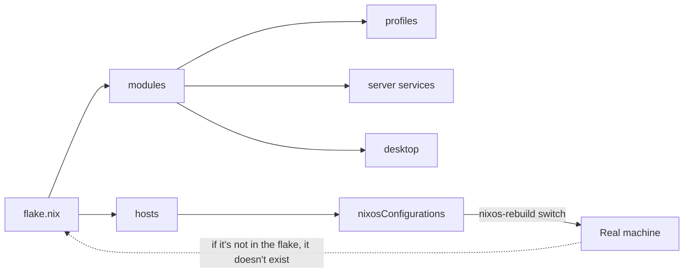

# "I use NixOS btw."

<Tldr title="TL;DR — Executive Summary">
**Result:** My entire infrastructure — seven machines, from a production server to a gaming PC — is defined in **a single Nix flake**, versioned on GitHub and **tested in CI on every PR**.

**Concretely:**
- **Blank-slate impermanence:** my server's root is restored to an *empty ZFS snapshot* on every boot via a systemd service I wrote myself. Anything not declared in code disappears.
- **Neovim = build output:** my editor (theme, LSP, Rust debugger, keymaps) is generated by Nix, not installed by hand.
- **Auto-generated routing:** Traefik rules are *derived* from service declarations — I declare a service and its subdomain, TLS, and middlewares appear on their own.
- **Encrypted secrets:** no plaintext keys in the repo; everything flows through `sops-nix` + age encryption.
</Tldr>

It's a meme, but for me it's a survival strategy. After years of wrestling with "standard" Linux distributions where a system update or a hardware swap could break days of tweaking, I made a decision: my setup had to be **as version-controlled as my code**.

The result is [`Strange500/nixos-config`](https://github.com/Strange500/nixos-config): seven machines, radically different roles, and yet **one flake**, **one repo**, **one source of truth**. This post is the story of how I got there — and why I'm never going back.

---

## The problem: accidental state

We've all been there. Three days perfecting your Neovim config, installing the right LSP servers, tweaking your window manager. You feel productive. Then you switch laptops, or a dependency breaks, and you're back at square one.

That's "accidental state": your machine's state isn't *described* anywhere — it's the *residue* of thousands of commands typed over months. You can't reproduce it, version it, or diff it. It's silent technical debt, applied to your most intimate tool.

NixOS flips the burden of proof: instead of being a result, the machine's state becomes a **pure function of a file**.

---

## The thesis: code as truth



My repo is organized in three layers of reuse:

- **`hosts/`** — one entry per machine: `Server`, `Cube`, `Clovis`, `Septimius`, `Clotaire`, `pi` (ARM) and `installer`.
- **`modules/`** — reusable, composable modules: `profiles/` (`base`, `desktop`, `server`, `gaming`), `apps/` (Neovim, kitty, browser…), `system/` (boot, networking, TPM…), `server/` (Traefik, SSO, media, DNS, backups…) and `desktop/` (Hyprland/Niri, stylix).
- **`home.nix`** — the *home-manager* layer, applied to my two users (`hermes` and `misc`).

It's all wired in a `flake.nix` that also exposes **integration checks** (more on that later). What matters here is the principle: a machine isn't something I configure, it's something I **compile**.

---

## Impermanence: the clean-slate strategy

This is the most radical part of my setup, and my favorite to talk about.

Most people use the `impermanence` module to wipe the root on every boot. I started from a different constraint: my server runs on **ZFS**. So I wrote a systemd service that, in the initrd, *before* the root is mounted, rolls back to an empty snapshot:

```nix
# hosts/Server/disk-config.nix (excerpt)
boot.initrd.systemd.services.rollback-root = {
  description = "Rollback ZFS root to blank snapshot";
  wantedBy = [ "initrd.target" ];
  after = [ "zfs-import.target" ];
  before = [ "sysroot.mount" ];
  unitConfig.DefaultDependencies = "no";
  serviceConfig = {
    Type = "oneshot";
    ExecStart = "${config.boot.zfs.package}/bin/zfs rollback -r bpool_sata/local/root@blank";
  };
};
```

The `root@blank` snapshot was taken once, at install time. Since then, **on every boot, the root returns to a blank state**. It's an almost brutal guarantee: if I configure something and forget to write it in Nix, it's gone on the next reboot.

Whatever survives is declared explicitly in `environment.persistence`:

```nix
environment.persistence."/persist" = {
  enable = true;
  hideMounts = true;
  directories = [
    "/home"
    "/var/lib/sops"
    "/var/lib/nixos"
    "/var/lib/tailscale"
    "/etc/NetworkManager"
    "/root/.ssh"
  ];
  files = [
    "/etc/machine-id"
    "/etc/ssh/ssh_host_ed25519_key"
    "/etc/ssh/ssh_host_rsa_key"
  ];
};
```

<Alert variant="info">
  **Why this is powerful:** impermanence forces honesty. A manual tweak, an on-the-fly change, a prod hack — all of it has a half-life of *one reboot*. Your system ends up, by construction, **100% documented by code**, because code is the only thing that survives.
</Alert>

The flip side is that this rollback demands real rigor on the *disk*. So I described the entire storage topology with **disko**: a mirrored `rpool` (two 16 TB HDDs) accelerated by a *special vdev* (NVMe + SATA SSD for metadata), and a system-only `bpool_sata` carrying `/`, `/nix` and `/persist`. Partitioning is code — versioned, diffable.

---

## Multi-host: one flake, seven realities

The real power of this approach shows when a config serves not *one* machine but a *fleet*. Each host composes shared *profiles*:

| Host | Role | Composition |
|------|------|-------------|
| **Server** | Production homelab | `base` + `server` (Traefik, Authelia/LLDAP, Podman, media, backups) |
| **Cube** | SteamOS-like gaming PC | `base` + `desktop` + `gaming` (Jovian-NixOS) |
| **Clovis / Septimius** | Dev desktops | `base` + `desktop`, shared Rust modules |
| **Clotaire** | Secondary desktop | `base` + `desktop` |
| **pi** | Raspberry Pi (ARM) | `base`, lightweight role |
| **installer** | Install image | Reproducible ISO |

`Cube` is my favorite example. I wanted a "SteamOS" experience on generic hardware. In a few lines, **Jovian-NixOS** gives me Steam, the *decky-loader*, and a `gamemode` that pushes the AMD GPU to its limits:

```nix
# hosts/Cube/configuration.nix (excerpt)
jovian = {
  steam = {
    enable = true;
    autoStart = true;
    desktopSession = "gnome";
  };
  decky-loader.enable = true;
  hardware.has.amd.gpu = true;
};

programs.gamemode = {
  enable = true;
  settings.gpu = {
    apply_gpu_optimisations = "accept-responsibility";
    amd_performance_level = "high";
  };
};
```

And because `Cube` shares the same base modules as my desktop, I duplicate nothing — I compose.

---

## Declarative Neovim: the editor as build output

I never touch `.config/nvim` by hand anymore. My Neovim is a Nix module built with **NVF (Neovim Flake)**.

The idea is that the editor becomes a *deterministic output* of the build. No `:MasonInstall`, no half-configured plugins: the `tokyonight` theme, indentation, LSP and debugger are all declared:

```nix
# modules/apps/nvf/default.nix (excerpt)
config.vim = {
  options = {
    tabstop = 4;
    shiftwidth = 4;
    expandtab = true;      # essential in Rust
  };
  theme = {
    enable = true;
    name = "tokyonight";
    style = "night";
  };
  lsp = { enable = true; formatOnSave = true; };
  languages = { enableTreesitter = true; nix.enable = true; };
  git = { enable = true; gitsigns.enable = true; };
  debugger.nvim-dap = { enable = true; ui.enable = true; };
};
```

The part that took the most work is **Rust**. The `languages/rust.nix` module configures `rustaceanvim` (the rust-analyzer equivalent), runs **clippy on save**, and wires the DAP debugger to `codelldb`:

```nix
# modules/apps/nvf/languages/rust.nix (excerpt)
vim.globals.rustaceanvim = {
  dap = {
    adapter.executable.command =
      "${pkgs.vscode-extensions.vadimcn.vscode-lldb}/share/vscode/extensions/vadimcn.vscode-lldb/adapter/codelldb";
  };
  server.default_settings."rust-analyzer" = {
    checkOnSave.command = "clippy";
    inlayHints.typeHints.enable = true;
  };
};
vim.languages.rust = {
  enable = true;
  extensions.crates-nvim.enable = true;
  dap.enable = true;
};
```

Result: when I move to a new machine, I don't *install* Neovim. I build my system, and my IDE is *there*, exactly as I left it — Rust debugger, clippy and all.

---

## The server: a homelab as code

The most rewarding part is arguably the server. I barely touch it by hand anymore: Traefik, authentication, containers and backups are all declarative.

My favorite pattern involves **Traefik**. Instead of writing routing files by hand, each service exposes its config through a `qgroget.services` option, and I **generate** the dynamic config file by folding all the declarations together:

```nix
# modules/server/traefik/default.nix (excerpt)
services = config.qgroget.services;

mergedTraefikConfig =
  lib.foldl'
  lib.recursiveUpdate
  {}
  (map (svc: svc.traefikDynamicConfig) (lib.attrValues services));
```

In practice: I declare a service with a subdomain, and its Traefik entry — routing, Let's Encrypt TLS, middlewares — **appears on its own**. Add a `geoblock` middleware restricting access to France, and optional **mTLS** for sensitive services:

```nix
tls.options.mtls = {
  minVersion = "VersionTLS12";
  clientAuth = {
    CAFiles = [ "${config.sops.secrets."server/traefik/clientCaCert".path}" ];
    clientAuthType = "RequireAndVerifyClientCert";
  };
};
```

On the other side, **Authelia + LLDAP** handle authentication (OIDC/LDAP), and services run as **rootless Podman/Quadlet** containers. The whole stack covers:
- **Media**: Jellyfin, Immich, the ARR stack (Sonarr, Radarr, Bazarr, Prowlarr…), qBittorrent behind a Gluetun VPN;
- **Infra**: AdGuardHome + Unbound (DNS), Vaultwarden (passwords), Obsidian LiveSync;
- **Backup**: Restic + Borg, to `/persist` and volumes.

It's a full homelab, and yet **every piece is a line of Nix**. The day I need to migrate, I don't replay hours of setup — I rebuild.

---

## Secrets: never in plaintext

A homelab handles secrets — GitHub tokens, SSH keys, certificates, service passwords. Committing them in plaintext would be a dealbreaker.

I use **sops-nix** with an **age** key. Secrets live in `secrets/secrets.yaml`, encrypted, and are **injected at runtime** exactly where each service expects them:

```nix
sops = {
  age.keyFile = "${config.qgroget.secretAgeKeyPath}";
  defaultSopsFile = ./secrets/secrets.yaml;
  defaultSymlinkPath = "/run/user/1000/secrets";
  secrets = {
    "git/ssh/private".path = "/run/user/1000/secrets/git/ssh/private";
    "github_token" = {};
  };
};
```

The repo stays public and safe: no one can rebuild a secret from the code, yet every service starts with its own, mounted in the right place, with the right permissions.

---

## CI: your config has a test suite

This is the step that turns NixOS from a gadget into an engineering tool. Because the config *is* code, **it can be tested**. My GitHub Actions workflow does two things on every PR:

1. **`nix flake check`** — runs the `nixosTests` integration tests (notably for Jellyfin and Jellyseerr);
2. **builds the toplevel of every x86_64 host** — `Server`, `Clovis`, `Cube`, `Septimius`, `Clotaire`, `installer` — to verify that *all* machines still compile.

```yaml
# .github/workflows/ci.yml (excerpt)
strategy:
  fail-fast: false
  matrix:
    host: [Server, Clovis, Cube, Septimius, Clotaire, installer]
steps:
  - uses: cachix/cachix-action@v14
    with:
      name: strange500
      authToken: ${{ secrets.CACHIX_AUTH_TOKEN }}
  - run: nix build .#nixosConfigurations.${{ matrix.host }}.config.system.build.toplevel
```

A shared **Cachix** cache speeds everything up, and a daily job updates `flake.lock`. Result: if one of my machines stops building, I know **before** applying it to real hardware. My dotfiles have a CI pipeline — which is exactly the level of seriousness a working tool deserves.

---

## The limits: let's be honest

NixOS isn't a fairy tale, and I'd be dishonest to pretend otherwise.

- **The learning curve is real.** The Nix language and the nixpkgs API have a steep entry barrier, and the documentation is uneven. The first months are frustrating.
- **Debugging eval errors** (`infinite recursion`, `attribute missing`) can be opaque — the error rarely points at the real cause.
- **Not everything bends to the declarative model.** My `disk-config.nix` is literally commented *"DESCRIPTIVE, not prescriptive"*: I reverse-engineered it from the server's actual state, and it must never be used to reformat disks, or you lose data.
- **nixpkgs churn**: following `nixos-unstable` means accepting regular breaking changes, even though the flake and lock contain the damage.

These costs are real. But for me the math is simple: I'd rather pay the price *once*, upfront, in code, than pay it *on repeat* every time a machine breaks.

---

## Why this matters

If you're a developer in 2026, your environment is your craft. Don't let it be a collection of accidents. Make it a **declarative, versioned, reproducible** asset — something you can rebuild, diff, and test.

This isn't about aesthetics or belonging to a club. It's engineering: the same discipline you apply to your code, applied to the machine that runs it.

---

**Explore the code:** my entire setup is public — [Strange500/nixos-config](https://github.com/Strange500/nixos-config).

<Cta title="Let's build something together">
  I'm currently seeking a **3-month software engineering internship in the US, starting June 2027**. If your team cares about reproducible infrastructure, backend, or test automation, let's connect on [LinkedIn](https://www.linkedin.com/in/roget-benjamin).
</Cta>
