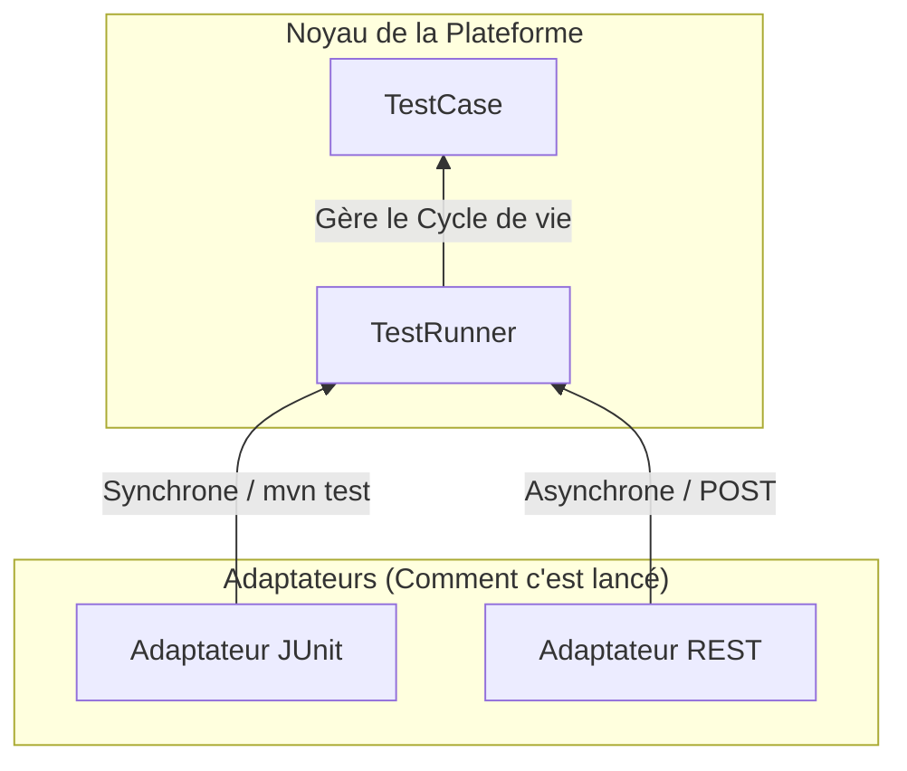

# Un Seul Test E2E, Multiples Voies d'Exécution : Construire une Plateforme de Test avec Spring Boot

<Tldr title="TL;DR — Résumé Exécutif">
**Résultat :** La plateforme de test E2E a été refondue pour qu'une seule définition de test s'exécute à la fois en CI synchrone (JUnit / Maven) et via un tableau de bord asynchrone interactif — sans dupliquer la moindre logique de test.

**Impact mesuré :**
- **~70 % d'échecs faussement positifs** en moins.
- Les exécutions invalides échouent en **~50 ms** au lieu de lancer une session navigateur de **20 s**.
- Une exécution non prête ne touche jamais l'état partagé : les testeurs **travaillant en parallèle sur le même environnement ne se gênent pas**.
</Tldr>

Notre suite de tests de bout-en-bout (E2E) avait initialement un modèle d'exécution unique : les tests étaient des classes JUnit exécutées via Maven à l'intérieur de pipelines Jenkins.

Cela fonctionnait bien pour les builds automatisés nocturnes, mais est devenu limitant à mesure que la plateforme grandissait :
- Les développeurs voulaient exécuter des scénarios spécifiques localement ou à la demande sans déclencher un build CI/CD complet.
- Les équipes QA et Produit avaient besoin d'un tableau de bord web interactif pour lancer des tests avec des jeux de paramètres personnalisés.
- Des sessions de navigateur coûteuses étaient constamment lancées pour finalement échouer 5 secondes plus tard en raison de prérequis techniques ou métier non satisfaits.

L'idée initiale était d'ajouter un contrôleur REST par-dessus le code de test. Cependant, procéder ainsi crée directement deux voies d'exécution divergentes :


```text
Jenkins ──> JUnit ──> Logique de Test

Web UI  ──> REST  ──> Logique de Test
```

Sans un noyau partagé, ces deux voies s'éloignent rapidement dans leur manière de gérer les paramètres, le cycle de vie du navigateur, le contexte de journalisation et les formats de résultats.

La thèse architecturale de la refonte était simple :

> **Un test doit être entièrement ignorant de la manière dont il est lancé.**

Ce principe a conduit à une séparation stricte entre *ce qui* est testé et *comment* il est exécuté :



Cet article détaille l'implémentation de cette plateforme de test agnostique en matière d'exécution à l'aide de Spring Boot et JUnit 5.

---

## 1. Découpler la Définition de l'Exécution

Une séparation nette des responsabilités requiert deux couches distinctes :

1. **`TestCase<P>`** : Définit la configuration du test (métadonnées, conditions requises et étapes métier).
2. **`TestRunner`** : Gère le cycle de vie de l'exécution (évaluation des préconditions, gestion du driver Selenium, génération structurée des résultats).

### La Définition du Test (`TestCase<P>`)

Chaque classe de test est un composant Spring héritant de `TestCase<P>`, paramétré par un DTO `P`. Elle ne contient aucune logique d'exécution.

```java
package com.example.framework.testcase;

import com.example.framework.condition.ExecutionCondition;
import java.util.List;

public abstract class TestCase<P extends BaseTestParams> {

    public abstract String id();
    public abstract String name();
    
    // Définition du type pour l'analyse de la charge utile REST
    public abstract Class<P> parameterType();
    
    // Jeux de données par défaut pour les pipelines CI automatisés
    public abstract List<P> defaultParameters();
    
    // Logique du scénario principal implémentée par le développeur de tests
    public abstract boolean execute(P params) throws Exception;

    // Prérequis déclaratifs (Évalués AVANT l'ouverture d'un navigateur)
    public List<ExecutionCondition> conditions() {
        return List.of();
    }
}
```

### L'Orchestrateur (`TestRunner`)

Le service `TestRunner` encapsule le cycle de vie. Il est le seul composant autorisé à toucher à la logique d'exécution des tests sous-jacente, garantissant que, quel que soit celui qui a déclenché le test, l'environnement est configuré et démonté de manière identique. Le processus entier, y compris les préconditions, est enveloppé dans un `try-catch` pour garantir une journalisation structurée.

```java
package com.example.framework.engine;

import com.example.framework.testcase.TestCase;
import com.example.framework.result.TestResult;
import org.springframework.stereotype.Service;

@Service
public class TestRunner {

    private final WebDriverManager driverManager;

    public TestRunner(WebDriverManager driverManager) {
        this.driverManager = driverManager;
    }

    public <P extends BaseTestParams> TestResult run(TestCase<P> testCase, P params) {
        long startTime = System.currentTimeMillis();

        try {
            // 1. Évaluer les Préconditions à Froid
            for (ExecutionCondition condition : testCase.conditions()) {
                var result = condition.evaluate();
                if (!result.success()) {
                    return TestResult.skipped(result.reason(), startTime);
                }
            }

            // 2. Exécuter le Cycle de vie
            driverManager.initDriver(params.getBrowser());
            boolean success = testCase.execute(params);
            
            return success ? 
                TestResult.success(startTime) : 
                TestResult.failed("Les assertions du scénario ont échoué.", startTime);
                
        } catch (Exception e) {
            // Capturer les informations d'échec structurées
            return TestResult.crashed("Exception d'exécution non gérée", e, startTime);
        } finally {
            driverManager.quitDriverSafely();
        }
    }
}
```

---

## 2. Découverte des Tests et Paramètres Fortement Typés

Si un test est agnostique à son déclencheur, le framework a besoin d'un mécanisme pour injecter les bons paramètres à partir des appels REST externes. Ceci est géré par le `TestRegistry`.

Puisque chaque `TestCase` est un `@Component` Spring, ils sont injectés dans un registre central au démarrage. Cela permet un modèle de routage à double usage :

* **Pour les APIs REST :** `parameterType()` permet au `ObjectMapper` de transformer le JSON brut en un record Java fortement typé `P`.
* **Pour la CI/CD :** `defaultParameters()` fournit les jeux de données de base afin que le moteur JUnit sache quoi exécuter automatiquement lors d'un build de pipeline.

```java
package com.example.framework.registry;

import com.fasterxml.jackson.databind.JsonNode;
import com.fasterxml.jackson.databind.ObjectMapper;
import org.springframework.stereotype.Component;
import java.util.Map;
import java.util.stream.Collectors;

@Component
public class TestRegistry {

    private final Map<String, TestCase<?>> tests;
    private final ObjectMapper objectMapper;

    public TestRegistry(List<TestCase<?>> testCases, ObjectMapper objectMapper) {
        this.objectMapper = objectMapper;
        this.tests = testCases.stream()
            .collect(Collectors.toMap(TestCase::id, t -> t));
    }

    public TestCase<?> get(String id) {
        if (!tests.containsKey(id)) {
            throw new IllegalArgumentException("Test non trouvé : " + id);
        }
        return tests.get(id);
    }

    public <P extends BaseTestParams> P parseParams(TestCase<P> testCase, JsonNode payload) {
        return objectMapper.convertValue(payload, testCase.parameterType());
    }
}
```

---

## 3. Modèle d'Exécution Asynchrone pour les Clients REST

Les tests E2E dans les plateformes d'entreprise prennent souvent entre 30 secondes et 15 minutes pour s'exécuter. Maintenir une connexion HTTP ouverte pendant cette durée provoque des délais d'attente (timeouts) de la passerelle et un épuisement des threads (thread starvation).

Pour gérer cela, l'API REST utilise un modèle de sondage (polling) asynchrone :

1. Le client soumet une requête `POST`.
2. Le serveur renvoie immédiatement `202 Accepted` avec un statut `QUEUED`.
3. Un pool de threads en arrière-plan évalue les préconditions et exécute le test.
4. Le client interroge périodiquement (polling) un point de terminaison `GET` pour observer les transitions d'état (`QUEUED` → `RUNNING` → `SUCCESS` | `FAILED` | `SKIPPED`).

```java
package com.example.framework.api;

import org.springframework.http.ResponseEntity;
import org.springframework.scheduling.concurrent.ThreadPoolTaskExecutor;
import org.springframework.web.bind.annotation.*;

@RestController
@RequestMapping("/api/v1/executions")
public class ExecutionController {

    private final TestRegistry testRegistry;
    private final TestRunner testRunner;
    private final ExecutionTaskStore taskStore;
    private final ThreadPoolTaskExecutor testExecutor;

    @PostMapping
    public ResponseEntity<ExecutionTask> startExecution(@RequestBody ExecutionRequest request) {
        var testCase = testRegistry.get(request.testId());
        var params = testRegistry.parseParams(testCase, request.payload());
        
        String executionId = UUID.randomUUID().toString();
        ExecutionTask task = taskStore.create(executionId, testCase.name()); // Statut : QUEUED

        testExecutor.submit(() -> {
            taskStore.markRunning(executionId);
            
            var result = testRunner.run(testCase, params); 
            
            taskStore.markCompleted(executionId, result);
        });

        return ResponseEntity.accepted().body(task);
    }
}
```

---

## 4. Adaptation à la CI/CD avec les Tests Dynamiques JUnit 5

Tandis que l'API REST exécute les tests de manière asynchrone pour l'interface web, Jenkins et Maven nécessitent des exécutions JUnit 5 synchrones pour produire des rapports XML Surefire standards.

L'adaptateur JUnit utilise le `@TestFactory` de JUnit 5 pour s'accrocher exactement au même `TestRunner`, en développant automatiquement les jeux de données paramétrés fournis par `defaultParameters()` :

```java
package com.example.framework.adapter.junit;

import org.junit.jupiter.api.Assumptions;
import org.junit.jupiter.api.DynamicTest;
import org.junit.jupiter.api.TestFactory;

@Component
public class TestSuiteFactory {

    @Autowired
    private TestRegistry registry;

    @Autowired
    private TestRunner testRunner;

    @TestFactory
    public Stream<DynamicTest> generateDynamicTests() {
        return registry.getAll().stream().flatMap(testCase -> 
            testCase.defaultParameters().stream().map(params -> 
                DynamicTest.dynamicTest(
                    testCase.name() + " (" + params.getEnvironment() + ")",
                    () -> executeInJUnitContext(testCase, params)
                )
            )
        );
    }

    @SuppressWarnings("unchecked")
    private <P extends BaseTestParams> void executeInJUnitContext(TestCase<P> testCase, Object params) {
        var result = testRunner.run(testCase, (P) params);

        if (result.status() == TestStatus.SKIPPED) {
            Assumptions.assumeTrue(false, result.message()); 
        }

        org.junit.jupiter.api.Assertions.assertEquals(
            TestStatus.SUCCESS, 
            result.status(), 
            "Le test a échoué : " + result.message()
        );
    }
}
```

> **Note sur l'Affichage CI :** En mappant le statut interne `SKIPPED` avec le `Assumptions.assumeTrue(false)` de JUnit, les lanceurs de tests natifs enregistrent l'exécution comme *Avortée*. Les outils de CI/CD comme Jenkins consomment ce rapport et classifient correctement le test comme instable ou ignoré (skipped), évitant ainsi les échecs de pipeline faussement positifs. En pratique, cette correspondance a réduit d'environ 70 % les échecs de pipeline faussement positifs.

---

## 5. Préconditions à Froid : Vérifier la Réalité Métier

Lancer une session Selenium WebDriver prend un temps considérable. Exécuter cette configuration pour découvrir qu'un état métier requis n'a pas été atteint gaspille du temps de calcul.

Le framework utilise des garde-fous légers qui vérifient les APIs HTTP ou les états de la base de données avant l'initialisation du navigateur. Ces vérifications valident des scénarios métier spécifiques plutôt que la simple disponibilité de l'infrastructure.

### Exemple : Vérification des Prérequis de Données de Paie

Considérez un test qui simule la déclaration d'une absence thérapeutique à temps partiel. Avant d'ouvrir le navigateur, le framework évalue le contexte métier :

```java
package com.example.framework.condition;

public class TherapeuticAbsenceDsnCondition implements ExecutionCondition {

    private final HrApiClient apiClient;
    private final String agentId;

    public TherapeuticAbsenceDsnCondition(HrApiClient apiClient, String agentId) {
        this.apiClient = apiClient;
        this.agentId = agentId;
    }

    @Override
    public ConditionResult evaluate() {
        if (!apiClient.checkAgentExists(agentId)) {
            return new ConditionResult(false, "L'ID de l'agent " + agentId + " est manquant.");
        }
        if (!apiClient.isPayrollPeriodActive()) {
            return new ConditionResult(false, "La période de paie DSN actuelle est fermée.");
        }
        if (!apiClient.hasTherapeuticAbsence(agentId)) {
            return new ConditionResult(false, "Aucune absence thérapeutique trouvée à déclarer.");
        }
        
        return new ConditionResult(true, "Prérequis métier satisfaits. Prêt à tester.");
    }
}
```

Si cette évaluation échoue, l'API REST renvoie une charge utile `SKIPPED`. Dans la CI, JUnit signale un test avorté. Cela réduit le temps de calcul d'un test invalide de 20 secondes à 50 millisecondes. Et comme chaque prérequis est validé *avant* l'ouverture d'une session navigateur ou toute mutation de données, une exécution non prête ne touche jamais l'état partagé — les testeurs travaillant en parallèle sur le même environnement ne se gênent donc pas.

---

## Limites Architecturales

Cette plateforme résout l'orchestration et le routage de l'exécution. Elle ne résout pas :

* **La Persistance de l'État d'Exécution :** L'adaptateur REST asynchrone gère les tâches d'exécution en mémoire. Si l'application Spring Boot redémarre, les tâches en cours ou en file d'attente sont perdues, à moins d'être adossées à une base de données ou une file persistante.
* **Les Sélecteurs Instables (Flaky Locators) :** Une architecture découplée ne répare pas les sélecteurs CSS fragiles ou les conditions de concurrence (race conditions) dans Selenium.
* **La Mutation de l'État des Données de Test :** Bien que les préconditions vérifient l'existence des données, gérer le nettoyage et l'isolation des données altérées dans un environnement partagé reste un défi infrastructurel distinct.

## Conclusion & Résultats

La définition d'un test n'est pas l'exécution d'un test.

En traitant un test E2E comme un modèle de domaine paramétré (`TestCase` → `TestRunner`), l'architecture offre une flexibilité significative : le même code Java qui s'exécute de manière synchrone dans un build nocturne Jenkins alimente un tableau de bord frontal interactif et asynchrone, avec la sécurité du typage à la frontière Java et une évaluation intelligente des préconditions.

Les résultats mesurés :

* **~70 % d'échecs faussement positifs** en moins.
* Les exécutions invalides échouent en **~50 ms** au lieu de lancer une session navigateur de **20 s**.
* L'exécution d'un testeur **n'interfère plus** avec celles des autres testeurs sur le même environnement partagé.

<Cta title="Travaillons ensemble">
  Je recherche actuellement un **stage d'ingénieur logiciel de 3 mois, à partir de juin 2027**. Si votre équipe fait face à des défis similaires en automatisation de tests ou en infrastructure backend, connectons-nous sur [LinkedIn](https://www.linkedin.com/in/roget-benjamin).

  *Note : les extraits de code de cet article sont simplifiés et illustratifs — le code source de production est propriétaire.*
</Cta>
