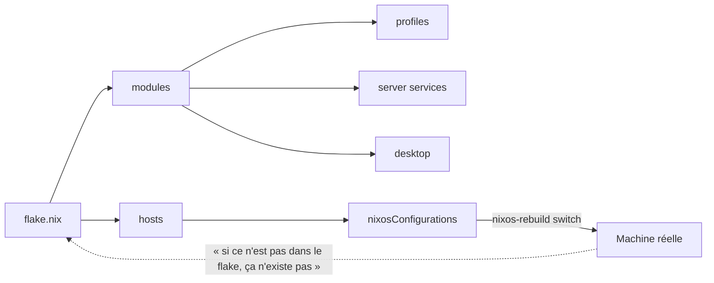

# « I use NixOS btw. »

<Tldr title="TL;DR — Résumé Exécutif">
**Résultat :** Mon infrastructure entière — sept machines, du serveur de prod au PC de jeu — est définie dans **un seul flake Nix**, versionné sur GitHub et **testé en CI à chaque PR**.

**Concrètement :**
- **Impermanence à blanc :** la racine de mon serveur est restaurée sur un *snapshot ZFS vide* à chaque boot via un service systemd que j'ai écrit moi-même. Tout ce qui n'est pas déclaré dans le code disparaît.
- **Neovim = sortie de build :** mon IDE (thème, LSP, débugger Rust, raccourcis) est généré par Nix, pas installé à la main.
- **Routage auto-généré :** les règles Traefik sont *dérivées* des déclarations de services — je déclare un service, son sous-domaine, son TLS et ses middlewares apparaissent tout seuls.
- **Secrets chiffrés :** aucune clé en clair dans le dépôt ; tout transite par `sops-nix` + chiffrement age.
</Tldr>

C'est un meme, mais pour moi c'est une stratégie de survie. Après des années à me battre contre des distributions « standards » où une mise à jour système ou un changement de machine pouvait casser des jours de réglages, j'ai pris une décision : ma configuration devait être **aussi versionnée que mon code**.

Le résultat, c'est [`Strange500/nixos-config`](https://github.com/Strange500/nixos-config) : sept machines, des rôles radicalement différents, et pourtant **un seul flake**, **un seul dépôt**, **une seule source de vérité**. Cet article raconte comment j'en suis arrivé là, et pourquoi je ne reviendrai jamais en arrière.

---

## Le problème : l'état accidentel

On est tous passés par là. Trois jours à peaufiner sa config Neovim, à installer les bons serveurs LSP, à ajuster son window manager. On se sent productif. Puis on change de laptop, ou une dépendance casse, et on repart de zéro.

C'est « l'état accidentel » : l'état de ta machine n'est pas *décrit* quelque part, il est le *résidu* de milliers de commandes tapées au fil des mois. Tu ne peux ni le reproduire, ni le versionner, ni le diff. C'est de la dette technique silencieuse, appliquée à ton outil de travail le plus intime.

NixOS inverse la charge de la preuve : au lieu d'être un résultat, l'état de la machine devient une **fonction pure d'un fichier**.

---

## La thèse : le code comme vérité



Mon dépôt est organisé en trois niveaux de réutilisation :

- **`hosts/`** — une entrée par machine : `Server`, `Cube`, `Clovis`, `Septimius`, `Clotaire`, `pi` (ARM) et `installer`.
- **`modules/`** — des modules réutilisables et composables : `profiles/` (`base`, `desktop`, `server`, `gaming`), `apps/` (Neovim, kitty, navigateur…), `system/` (boot, réseau, TPM…), `server/` (Traefik, SSO, médias, DNS, backups…) et `desktop/` (Hyprland/Niri, stylix).
- **`home.nix`** — la couche *home-manager*, appliquée à mes deux utilisateurs (`hermes` et `misc`).

Le tout est câblé dans un `flake.nix` qui expose aussi des **checks d'intégration** (j'y reviens). Ce qui compte ici, c'est le principe : une machine n'est pas quelque chose que je configure, c'est quelque chose que je **compile**.

---

## Impermanence : la stratégie de la table rase

C'est la partie la plus radicale de mon setup, et celle que je préfère raconter.

La plupart des gens utilisent le module `impermanence` pour effacer la racine à chaque boot. Moi, je suis parti d'une autre contrainte : mon serveur tourne sur **ZFS**. J'ai donc écrit un service systemd qui, dans l'initrd, *avant* le montage de la racine, fait un `rollback` sur un snapshot vide :

```nix
# hosts/Server/disk-config.nix (extrait)
boot.initrd.systemd.services.rollback-root = {
  description = "Rollback ZFS root to blank snapshot";
  wantedBy = [ "initrd.target" ];
  after = [ "zfs-import.target" ];
  before = [ "sysroot.mount" ];
  unitConfig.DefaultDependencies = "no";
  serviceConfig = {
    Type = "oneshot";
    ExecStart = "${config.boot.zfs.package}/bin/zfs rollback -r bpool_sata/local/root@blank";
  };
};
```

Le snapshot `root@blank` a été pris une fois, au moment de l'installation. Depuis, **à chaque démarrage, la racine revient à l'état vide**. C'est une garantie presque brutale : si je configure quelque chose et que j'oublie de l'écrire en Nix, il disparaît au prochain reboot.

Ce qui survit est déclaré explicitement dans `environment.persistence` :

```nix
environment.persistence."/persist" = {
  enable = true;
  hideMounts = true;
  directories = [
    "/home"
    "/var/lib/sops"
    "/var/lib/nixos"
    "/var/lib/tailscale"
    "/etc/NetworkManager"
    "/root/.ssh"
  ];
  files = [
    "/etc/machine-id"
    "/etc/ssh/ssh_host_ed25519_key"
    "/etc/ssh/ssh_host_rsa_key"
  ];
};
```

<Alert variant="info">
  **Pourquoi c'est puissant :** l'impermanence force l'honnêteté. Une config manuelle, une modification « au fil de l'eau », un hack en prod — tout ça a une demi-vie de *un reboot*. Ton système finit par être, par construction, **100 % documenté par le code**, parce que c'est la seule chose qui survive.
</Alert>

Le revers de la médaille, c'est que ce rollback exige une vraie rigueur sur le *disque*. J'ai donc décrit toute la topologie de stockage avec **disko** : un pool `rpool` en miroir (deux HDD 16 To) accéléré par un *special vdev* (NVMe + SSD SATA pour les métadonnées), et un `bpool_sata` dédié au système qui porte `/`, `/nix` et `/persist`. La partition, c'est du code, versionné, diffable.

---

## Multi-hôtes : un flake, sept réalités

La vraie force de cette approche apparaît quand une config ne sert plus *une* machine mais *une flotte*. Chaque host compose des *profils* partagés :

| Host | Rôle | Composition |
|------|------|-------------|
| **Server** | Homelab de prod | `base` + `server` (Traefik, Authelia/LLDAP, Podman, médias, backups) |
| **Cube** | PC de jeu type SteamOS | `base` + `desktop` + `gaming` (Jovian-NixOS) |
| **Clovis / Septimius** | Desktops dev | `base` + `desktop`, modules Rust partagés |
| **Clotaire** | Desktop secondaire | `base` + `desktop` |
| **pi** | Raspberry Pi (ARM) | `base`, rôle léger |
| **installer** | Image d'installation | ISO reproductible |

`Cube` est mon exemple favori. Je voulais une expérience « SteamOS » sur du matériel générique. En quelques lignes, **Jovian-NixOS** me donne Steam, le *decky-loader*, et un `gamemode` qui pousse le GPU AMD à fond :

```nix
# hosts/Cube/configuration.nix (extrait)
jovian = {
  steam = {
    enable = true;
    autoStart = true;
    desktopSession = "gnome";
  };
  decky-loader.enable = true;
  hardware.has.amd.gpu = true;
};

programs.gamemode = {
  enable = true;
  settings.gpu = {
    apply_gpu_optimisations = "accept-responsibility";
    amd_performance_level = "high";
  };
};
```

Et comme `Cube` partage les mêmes modules de base que mon desktop, je ne duplique rien : je compose.

---

## Neovim déclaratif : l'éditeur comme sortie de build

Je ne touche plus jamais à `.config/nvim` à la main. Mon Neovim est un module Nix construit avec **NVF (Neovim Flake)**.

L'idée, c'est que l'éditeur devient une *sortie déterministe* du build. Pas de `:MasonInstall`, pas de plugin à moitié configuré : le thème `tokyonight`, l'indentation, le LSP et le débugger sont tous déclarés :

```nix
# modules/apps/nvf/default.nix (extrait)
config.vim = {
  options = {
    tabstop = 4;
    shiftwidth = 4;
    expandtab = true;      # essentiel en Rust
  };
  theme = {
    enable = true;
    name = "tokyonight";
    style = "night";
  };
  lsp = { enable = true; formatOnSave = true; };
  languages = { enableTreesitter = true; nix.enable = true; };
  git = { enable = true; gitsigns.enable = true; };
  debugger.nvim-dap = { enable = true; ui.enable = true; };
};
```

La partie qui m'a demandé le plus de travail, c'est **Rust**. Le module `languages/rust.nix` configure `rustaceanvim` (l'équivalent de rust-analyzer), fait tourner **clippy au save**, et branche le débugger DAP sur `codelldb` :

```nix
# modules/apps/nvf/languages/rust.nix (extrait)
vim.globals.rustaceanvim = {
  dap = {
    adapter.executable.command =
      "${pkgs.vscode-extensions.vadimcn.vscode-lldb}/share/vscode/extensions/vadimcn.vscode-lldb/adapter/codelldb";
  };
  server.default_settings."rust-analyzer" = {
    checkOnSave.command = "clippy";
    inlayHints.typeHints.enable = true;
  };
};
vim.languages.rust = {
  enable = true;
  extensions.crates-nvim.enable = true;
  dap.enable = true;
};
```

Résultat : si je change de machine, je n'*installe* pas Neovim. Je build mon système, et mon IDE est *là*, exactement comme je l'ai laissé — débugger Rust, clippy et tout.

---

## Le serveur : un homelab comme du code

La partie la plus gratifiante est sans doute le serveur. Je n'y fais quasiment plus rien à la main : Traefik, l'authentification, les conteneurs et les backups sont tous déclaratifs.

Mon pattern préféré concerne **Traefik**. Plutôt que d'écrire des fichiers de routage à la main, chaque service expose sa config via une option `qgroget.services`, et je **génère** le fichier de config dynamique en repliant toutes les déclarations :

```nix
# modules/server/traefik/default.nix (extrait)
services = config.qgroget.services;

mergedTraefikConfig =
  lib.foldl'
  lib.recursiveUpdate
  {}
  (map (svc: svc.traefikDynamicConfig) (lib.attrValues services));
```

Concrètement : je déclare un service avec un sous-domaine, et son entrée Traefik — routage, TLS Let's Encrypt, middlewares — **apparaît toute seule**. Ajoute à ça un middleware `geoblock` qui restreint l'accès à la France, et du **mTLS** optionnel pour les services sensibles :

```nix
tls.options.mtls = {
  minVersion = "VersionTLS12";
  clientAuth = {
    CAFiles = [ "${config.sops.secrets."server/traefik/clientCaCert".path}" ];
    clientAuthType = "RequireAndVerifyClientCert";
  };
};
```

En face, **Authelia + LLDAP** gèrent l'authentification (OIDC/LDAP), et les services tournent en conteneurs **rootless Podman/Quadlet**. Le tout est orchestré par une pile qui couvre :
- **Médias** : Jellyfin, Immich, la stack ARR (Sonarr, Radarr, Bazarr, Prowlarr…), qBittorrent derrière un VPN Gluetun ;
- **Infra** : AdGuardHome + Unbound (DNS), Vaultwarden (mots de passe), Obsidian LiveSync ;
- **Sauvegarde** : Restic + Borg, vers `/persist` et les volumes.

C'est un homelab complet, et pourtant **chaque brique est une ligne de Nix**. Le jour où je dois migrer, je ne re-joue pas des heures de config : je rebuil.

---

## Secrets : rien en clair, jamais

Un homelab, ça manipule des secrets — tokens GitHub, clés SSH, certificats, mots de passe de services. Les committer en clair serait rédhibitoire.

J'utilise **sops-nix** avec une clé **age**. Les secrets vivent dans `secrets/secrets.yaml`, chiffrés, et sont **injectés au runtime** à l'endroit précis où le service les attend :

```nix
sops = {
  age.keyFile = "${config.qgroget.secretAgeKeyPath}";
  defaultSopsFile = ./secrets/secrets.yaml;
  defaultSymlinkPath = "/run/user/1000/secrets";
  secrets = {
    "git/ssh/private".path = "/run/user/1000/secrets/git/ssh/private";
    "github_token" = {};
  };
};
```

Le dépôt reste publique et sûr : personne ne peut reconstruire un secret depuis le code, et pourtant chaque service démarre avec le sien, monté au bon endroit, avec les bonnes permissions.

---

## La CI : ta config a une suite de tests

C'est le point qui transforme NixOS d'un gadget en outil d'ingénieur. Parce que la config est du code, **elle peut être testée**. Mon workflow GitHub Actions fait deux choses à chaque PR :

1. **`nix flake check`** — exécute les tests d'intégration `nixosTests` (notamment pour Jellyfin et Jellyseerr) ;
2. **build du toplevel de chaque host x86_64** — `Server`, `Clovis`, `Cube`, `Septimius`, `Clotaire`, `installer` — pour vérifier que *toutes* les machines compilent encore.

```yaml
# .github/workflows/ci.yml (extrait)
strategy:
  fail-fast: false
  matrix:
    host: [Server, Clovis, Cube, Septimius, Clotaire, installer]
steps:
  - uses: cachix/cachix-action@v14
    with:
      name: strange500
      authToken: ${{ secrets.CACHIX_AUTH_TOKEN }}
  - run: nix build .#nixosConfigurations.${{ matrix.host }}.config.system.build.toplevel
```

Un **cache Cachix** partagé accélère tout, et un job quotidien met à jour `flake.lock`. Résultat : si une de mes machines ne build plus, je le sais **avant** de l'appliquer sur le matériel réel. Mes dotfiles ont un pipeline de CI — et c'est exactement le niveau de sérieux que mérite un outil de travail.

---

## Les limites : soyons honnêtes

NixOS n'est pas un conte de fées, et je serais malhonnête de prétendre le contraire.

- **La courbe d'apprentissage est réelle.** Le langage Nix et l'API de nixpkgs ont une barrière d'entrée élevée, et la documentation est inégale. Les premiers mois sont frustrants.
- **Le débug des erreurs d'évaluation** (`infinite recursion`, `attribute missing`) peut être opaque — l'erreur pointe rarement vers la vraie cause.
- **Tout ne se plie pas au déclaratif.** Mon fichier `disk-config.nix` est littéralement commenté *« DESCRIPTIVE, not prescriptive »* : je l'ai rétro-ingénié depuis l'état réel du serveur, et il ne faut surtout pas l'utiliser pour reformater les disques sous peine de perte de données.
- **Le churn de nixpkgs** : suivre `nixos-unstable`, c'est accepter des breaking changes réguliers, même si le flake et le lock limitent la casse.

Ces coûts sont réels. Mais pour moi, le calcul est simple : je préfère payer le prix *une fois*, en amont, dans le code, plutôt que de le payer *en boucle* à chaque machine cassée.

---

## Pourquoi c'est important

Si tu es développeur en 2026, ton environnement est ton outil de travail. Ne le laisse pas être une collection d'accidents. Fais-en un actif **déclaratif, versionné et reproductible** — quelque chose que tu peux rebuilder, diff et tester.

Ce n'est pas une question d'esthétique ou d'appartenance à un club. C'est de l'ingénierie : la même discipline que tu appliques à ton code, appliquée à la machine qui l'exécute.

---

**Explore le code :** toute ma configuration est publique — [Strange500/nixos-config](https://github.com/Strange500/nixos-config).

<Cta title="Travaillons ensemble">
  Je recherche actuellement un **stage d'ingénieur logiciel de 3 mois, à partir de juin 2027**. Si votre équipe s'intéresse à l'infrastructure reproductible, au backend ou à l'automatisation de tests, connectons-nous sur [LinkedIn](https://www.linkedin.com/in/roget-benjamin).
</Cta>
